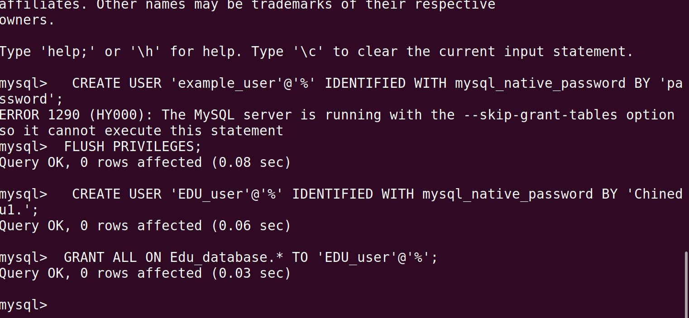
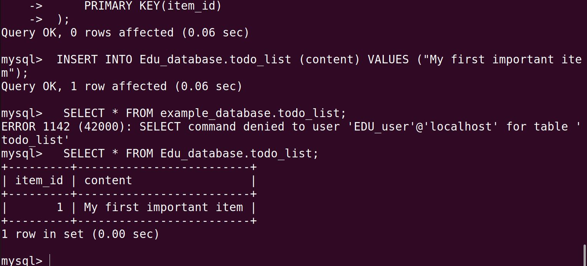

# Project2
Project 2 Report (PROJECT 2: LEMP STACK IMPLEMENTATION)

    `Installing the Nginx Web Server:
    
     I folllowed procedure copied and pasted on my linux and was able to get it to be active"

Step 2: Installing MYSQL

	`I was able to install and log in to mysql sheel after series of error messages. I ran the commands after which i exited.`

Step 3: Installing PHP

	` I ran the commands and installed PHP.`

Step 4: Configuring Nginx to use PHP Processor

	`I followed the procedure and ran the commands`

Step 5: Testing PHP with Nginx

	`I was able to test on my terminal, but was getting error message trying to access with my ip address on web browser. I tried all to troubleshoot but none of the solutions offered worked and i have been experincing thi from my Project 1. I  don't know if it's settimgs from my windows`

 

Step 6: RETRIEVING DATA FROM MYSQL DATABASE WITH PHP

	`I was able to create data base and create my own user with the procedures given. I was not able to get complete output as shown, but i was able to create the database and user and table as well`
    `I created the To-Do-List but like my step 5, i was not able to access on my web server as i stll got the same error message. I tried but still didn't work. `

 

'THANK YOU!!!!'

